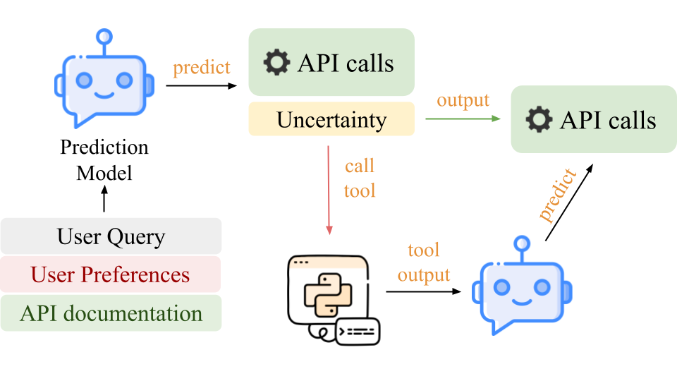

# :wrench: TAPS: Tool-Augmented Personalisation via Structured Tagging


**TAPS**, or **T**ool-**A**ugmented **P**ersonalision via **S**tructured Tagging, is the first fully-automated solution that leverages a structured tagging tool as well as an internal tool detection mechanism for contextualised tool-use in a dialogue setting on the [NLSI](https://aclanthology.org/2024.findings-naacl.255.pdf) dataset.




## :zap: Setup and Usage

Clone the current repository and install requirements:

```bash
# git clone removed for anonymity
cd tips/
pip install -r requirements.txt
```


### Data
Download the NLSI dataset from [HuggingFace](https://huggingface.co/datasets/nikitam/nlsi).

### Optimising Demonstrations

```bash
cd src/
python ../scripts/dspy_bootstrap.py \
    --model_name {model_name} \
    --prompt_file {path_to_prompt} \
    --output_dir {output_dir} \
    --max_bootstrapped_demos {max_bootstrapped_demos} \
    --max_labeled_demos {max_labeled_demos} \
    --num_candidate_programs {num_candidate_programs} \
    --num_threads {num_threads} 
```

To select demonstrations for **Tag-S** and **Tag-and-Generate** add  `--tag 'simple'` or `--tag 'cot'` argument, respectively.

**NB:** To evaluate OpenAI models, set an `OPENAI_KEY` environment variable.

### Run TAPS on NLSI

1. Run evaluation without uncertainty: 
    ```bash
    cd src
    python ../scripts/base_experiment.py \
        --model_name {model_name} \
        --use_gpt {use_gpt} \
        --test_dataset {path_to_test_dataset} \
        --n_shots {n_shots} \ 
        --prompt {prompt_file} \
    ```

    To evaluate in the **Tag-S** setting, add `--simple_aug 'tag'`. \
    To run  **Tag-and-Generate**, instead add `--tag 'cot'`.


2. Run evaluation with a tool detector:
    ```bash
    cd src
    python ../scripts/uncertainty_experiment.py \
        --model_name {model_name} \
        --use_gpt {use_gpt} \
        --test_dataset {path_to_test_dataset} \
        --n_shots {n_shots} \ 
        --prompt {prompt_file} \
        --aug_preds_fpath {aug_preds_fpath} 
    ```

    **NB:** currently to run the experiments with uncertainty you need to first run the experiment with the data augmentation tool on the whole dataset (see point 1). You then need to pass the path to the results using the `--aug_preds_fpath` argument.

3. Running experiments in the optimised setting

    To run both simple evaluation and evaluation with a tool detector with the optimised instructions, specify the following arguments:

    ```bash
        --setup_fpath {setup_fpath} \
        --use_setup_shots True \
        --use_setup_prompt True
    ```

    where `setup_fpath` is the path to a `.json` file output by the optimiser.

## :link: Cite Us

TBD

## Licence
Our code is available under the Apache 2.0 license.
